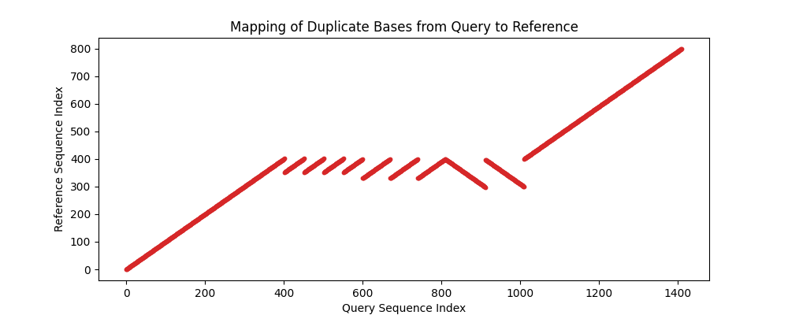

# 寻找样本DNA序列中的重复片段 实验报告

## 项目结构

本项目托管在GitHub上：[dywsy21/Algorithm-Design-and-Analysis-Projects](https://github.com/dywsy21/Algorithm-Design-and-Analysis-Projects)

以下为树状的项目结构图, 每个文件/文件夹后附加了其用途的解释：

```
DupIdentification (11.1KB)      # 项目文件夹
├── genome_utils.py (135b)        # 有关基因组的一些辅助函数，如rev() 
├── input (2.16KB)              # 输入
│   ├── query.txt (1.38KB)        # 输入的query
│   └── reference.txt (802b)      # 输入的reference
├── main.py (3.7KB)             # 主程序
├── README.md (925b)            # 说明
├── veriplot.py (1.45KB)        # 辅助函数：验证+绘图
```

## 算法细节

本算法使用后缀自动机（Suffix Automaton）实现高效的序列匹配和重复片段检测。主要步骤包括：（设reference串的长度为r，query串的长度为q）

### 后缀自动机构建

- 为参考序列（reference）和其反向互补序列分别构建后缀自动机
- 后缀自动机是一个有向无环图（DAG），能够高效匹配所有子串
- 每次构建的时间复杂度为$O(n)$，其中n为序列长度
- 总时间复杂度为$O(r + q)$
- 空间复杂度为$O(r)$，每个后缀自动机需要存储状态和转移边

伪代码如下：

```
ALGORITHM BUILD-SUFFIX-AUTOMATON(s)
    sam ← new SuffixAutomaton
    sam.size ← 1
    sam.last ← 0
    sam.states[0] ← new State
    
    for each character c in s
        EXTEND(sam, c)
    return sam

PROCEDURE EXTEND(sam, c)
    p ← sam.last
    curr ← sam.size
    sam.size ← sam.size + 1
    sam.states[curr] ← new State
    sam.states[curr].len ← sam.states[p].len + 1
    
    while p ≥ 0 and c ∉ sam.states[p].next
        sam.states[p].next[c] ← curr
        p ← sam.states[p].link
    
    if p = -1
        sam.states[curr].link ← 0
    else
        q ← sam.states[p].next[c]
        if sam.states[p].len + 1 = sam.states[q].len
            sam.states[curr].link ← q
        else
            clone ← sam.size
            sam.size ← sam.size + 1
            sam.states[clone] ← new State
            sam.states[clone].len ← sam.states[p].len + 1
            sam.states[clone].next ← copy of sam.states[q].next
            sam.states[clone].link ← sam.states[q].link
            
            while p ≥ 0 and sam.states[p].next[c] = q
                sam.states[p].next[c] ← clone
                p ← sam.states[p].link
                
            sam.states[q].link ← clone
            sam.states[curr].link ← clone
    
    sam.last ← curr
```

### 最大匹配预计算

- 对于查询序列（query）中的每个位置i，计算：
  * 与参考序列的最大匹配长度（len_ref）
  * 与反向互补参考序列的最大匹配长度（len_inv）
- 记录每个位置的(max_len, inverted)元组，其中：
  * max_len：两种匹配的较大值
  * inverted：标记是否为反向互补匹配
- 总时间复杂度$O(q^2)$
- 空间复杂度为$O(q)$，用于存储max_lengths数组

伪代码如下：

```
ALGORITHM FIND-MAX-LENGTH(sam, query, start)
    current_state ← 0
    max_len ← 0
    
    for j ← start to length[query] - 1
        c ← query[j]
        if c ∈ sam.states[current_state].next
            current_state ← sam.states[current_state].next[c]
            max_len ← max_len + 1
        else
            break
    
    return max_len
```

### 重复片段识别

- 顺序扫描查询序列，对于每个可能的起始位置：
  1. 确定当前位置的重复片段长度（dup_len）
  2. 提取相应子串，并计算其在参考序列中的位置（考虑反向互补）
  3. 检测是否存在连续重复：
     * 比较后续位置是否为相同子串
     * 验证是否具有足够的匹配长度
     * 保持重复片段长度一致
  4. 记录重复信息：(参考起始位置，重复长度，连续次数，是否反向)
  5. 跳过已处理的重复区域，继续检测
- 总时间复杂度为$O(qr + q^2)$
- 空间复杂度为$O(d)$，其中d为识别到的重复片段数量

伪代码如下：

```
ALGORITHM FIND-DUPLICATES(reference, query)
    # Prepare inverse reference and build suffix automatons
    inv_reference ← INV(reference)
    sam_ref ← BUILD-SUFFIX-AUTOMATON(reference)
    sam_inv_ref ← BUILD-SUFFIX-AUTOMATON(inv_reference)
    
    # Precompute maximum matching lengths
    max_lengths ← array of size length[query]
    for i ← 0 to length[query] - 1
        len_ref ← FIND-MAX-LENGTH(sam_ref, query, i)
        len_inv ← FIND-MAX-LENGTH(sam_inv_ref, query, i)
        max_len ← max(len_ref, len_inv)
        inverted ← (len_inv > len_ref) OR (len_inv = len_ref AND len_inv > 0)
        max_lengths[i] ← (max_len, inverted)
    
    # Identify duplicates
    result ← empty array
    i ← 0
    while i < length[query]
        if max_lengths[i][0] = 0
            i ← i + 1
            continue
            
        dup_len ← max_lengths[i][0]
        current_inverted ← max_lengths[i][1]
        substr ← query[i..i+dup_len-1]
        count ← 1
        j ← i + dup_len
        
        # Check for consecutive duplicates
        while j ≤ length[query] - dup_len
            ml, inv_flag ← max_lengths[j]
            if ml < dup_len OR inv_flag ≠ current_inverted 
               OR query[j..j+dup_len-1] ≠ substr
                break
            count ← count + 1
            j ← j + dup_len
        
        # Find position in reference
        if current_inverted
            ref_substr ← INV(substr)
        else
            ref_substr ← substr
        ref_start ← index of first occurrence of ref_substr in reference
        
        # Record result and skip processed region
        result.append((i, ref_start, dup_len, count, current_inverted))
        i ← j
    
    return result

PROCEDURE INV(s)
    BP_MAP ← {'A': 'T', 'T': 'A', 'C': 'G', 'G': 'C', 'N': 'N'}
    result ← empty string
    for i ← length[s] - 1 downto 0
        result ← result + BP_MAP[s[i]]
    return result
```

### 总复杂度

- 整个算法的总时间复杂度为$O(r + q + q^2 + qr + q^2) = O(q^2)$
- 整个算法的总空间复杂度为$O(r + q + d)$，由于d < q，所以空间复杂度是线性的

## 成果展示

在算法得出结果后，我们调用veriplot中的验证及绘图函数绘制出结果，以下为示例reference和query得出的结果：

| Reference Position | Length | Consecutive Count | Inverted |
|-------------------|--------|------------------|----------|
| 0 | 402 | 1 | No |
| 352 | 50 | 3 | No |
| 352 | 48 | 1 | No |
| 330 | 70 | 3 | No |
| 298 | 102 | 1 | Yes |
| 300 | 98 | 1 | Yes |
| 400 | 400 | 1 | No |

以下为veriplot中绘图函数绘制结果：

